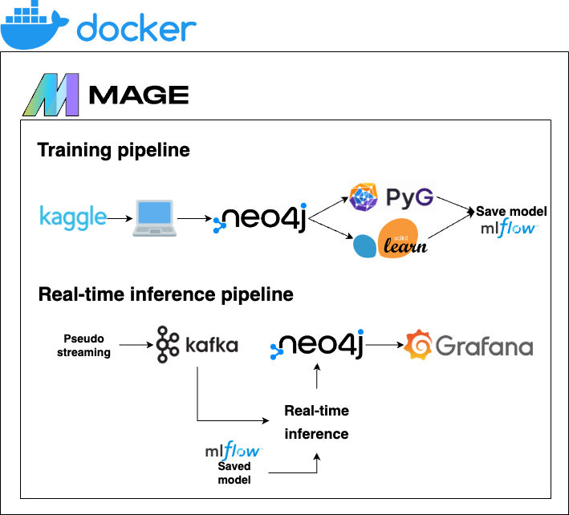
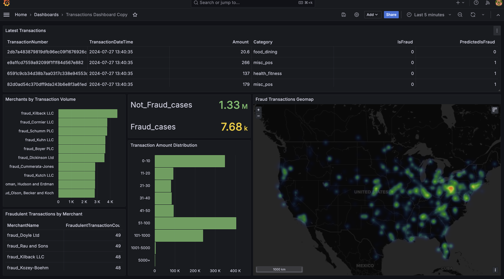
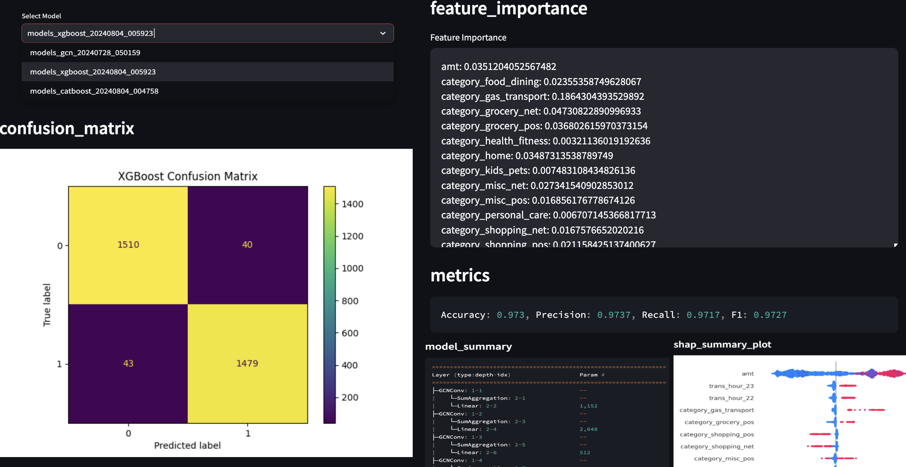

# Project overview



Created using [draw.io](https://draw.io/)

* **Kaggle** - Transaction data is taken from [here](https://www.kaggle.com/datasets/kartik2112/fraud-detection)
* **Docker** - used for containerization to ensure that the application is consistent across different environments
* **Mlflow** - used for easy model comparison during development
* **Model training** - models are trained using a combination of libraries: sklearn, xgboost, catboost, PyG
* **Mage** - used for pipeline orchestration of the model training and real-time inference pipelines
* **Neo4j** - used as a Graph database to store transaction data as nodes and edges
* **Kafka** - used to ensure real-time transaction processing
* **Grafana** - used for real-time dashboard creation and monitoring
* **Streamlit** - used to host a model dictionary showing models, evaluation metrics, and feature importance graphs

# Data description


Created using [arrows.app](https://arrows.app/)

# Real-time inference pipeline

To simulate real-time information, we use the Kaggle `fraudTest.csv` dataset and send 5 transactions every second through Kafka. The transactions are received and new columns, where the models predict not fraud/fraud, are created. This data is sent to neo4j and used in the Grafana dashboard, which updates every 5 seconds with the latest information. 

# Monitoring

Information from Neo4j is extracted and visualised through a real-time dashboard in Grafana



# Model decision-making

To better understand what factors influence a model's decision to classify a transaction as not fraud or fraud, a model dictionary hosted on Streamlit is set up. Information that can be seen:
* model location/information
* feature importance
* model metrics
* confusion matrix
* SHAP summary plot



# Reproducability

**Prerequisite**
* Docker desktop
* Python >=3.9

**Setup**
1. Clone the repo `https://github.com/divakaivan/kb_project.git`
2. Place your Kaggle API credentials in `mage_orchestration` as `kaggle.json`
3. Type `make` in the terminal and you should see something like
```
Usage: make [option]

Options:
  help                 Show this help message
  build                Build docker services
  start                Start docker services (detached mode)
  model-dict           Create model dictionary UI
  stop                 Stop docker services
```
4. Start with `make build` to build all the docker services from `docker-compose.yaml`
5. Next, run `make start` to start all the built docker services (to stop them, run `make stop`)

**Training models**
1. Go to Mage, which is running on http://localhost:6789, go to the Pipelines page from the sidebar
2. Start with the `get_kaggle_data` pipeline to download the data from Kaggle
3. Then, run `load_batch_into_neo4j`
4. Run one (or multiple) of the `train_*` pipeline

**Real-time transaction processing**
1. You need to have run at least one of the `train_*` pipelines
2. When you ran `make start` the kafka-producer service started sending transactions, so now if you run the `stream_predictions` pipeline, in the bottom right corner you should see transactions being processed. Also new transactions loaded into neo4j can be seen (due the to TRANSACTION number increasing). The dataset used in the kafka-producer service has >500,000 rows so if you leave it to run it will keep sending data for more than 30 hours (5 transactions sent per second)

**Monitoring**
1. Once the `stream_predictions` pipeline is running in Mage, you can open Grafana at http://localhost:3000
2. The connection to neo4j and dashboard is pre-loaded, so you can directly go to the Dashboards section

**Model dictionary**
- There are some models already in the repository, so you can run `make model-dict` in the terminal. This will install the necessary denepdencies and open up the Streamlit UI in your browser (alternatively, go to http://localhost:8501)
- Seeing something here requires for at least 1 of the `train_*` pipelines in mage to have been run

**Docker Services Information**
| Service   | Port |
|-----------|------|
| neo4j     | 7474/7687 |
| mage      | 6789 |
| kafka     | 9093 |
| zookeeper | 2181 |
| mlflow    | 5001 |
| grafana   | 3000 |

# Future improvements

* Use a cloud provider for the following services (and use Terraform to serve the resources):
    * MLflow database and artifact store
    * Mage 
* Use the official cloud option for:
    * Neo4j database
    * Grafana
* Deploy Streamlit for improved accessibility
* Add unit/integration tests
* Load models from Mlflow in the model dictionary
