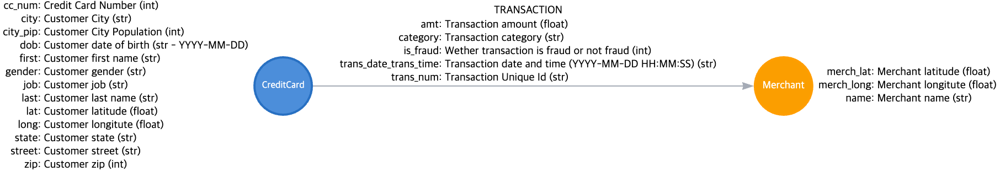

# Project overview

Created using [draw.io](https://draw.io/)

* **Kaggle** - Transaction data is taken from [here](https://www.kaggle.com/datasets/kartik2112/fraud-detection)
* **Docker** - used for containerization to ensure that the application is consistent across different environments
* **Mlflow** - used for easy model comparison during development
* **Model training** - models are trained using a combination of libraries: sklearn, xgboost, catboost, PyG
* **Mage** - used for pipeline orchestration of the model training and real-time inference pipelines
* **Neo4j** - used as a Graph database to store transaction data as nodes and edges
* **Kafka** - used to ensure real-time transaction processing
* **Grafana** - used for real-time dashboard creation and monitoring
* **Streamlit** - used to host a model dictionary showing models, evaluation metrics, and feature importance graphs

# Data description

Created using [arrows.app](https://arrows.app/)

# Real-time inference pipeline

To simulate real-time information, we use the Kaggle `fraudTest.csv` dataset and send 5 transactions every second through Kafka. The transactions are received and new columns, where the models predict not fraud/fraud, are created. This data is sent to neo4j and used in the Grafana dashboard, which updates every 5 seconds with the latest information. 

# Reproducability

TODO

# Future improvements

* Use a cloud provider for the following services (and use Terraform to serve the resources):
    * MLflow database and artifact store
    * Mage 
* Use the official cloud option for:
    * Neo4j database
    * Grafana
* Deploy Streamlit for improved accessibility
* Add unit/integration tests
