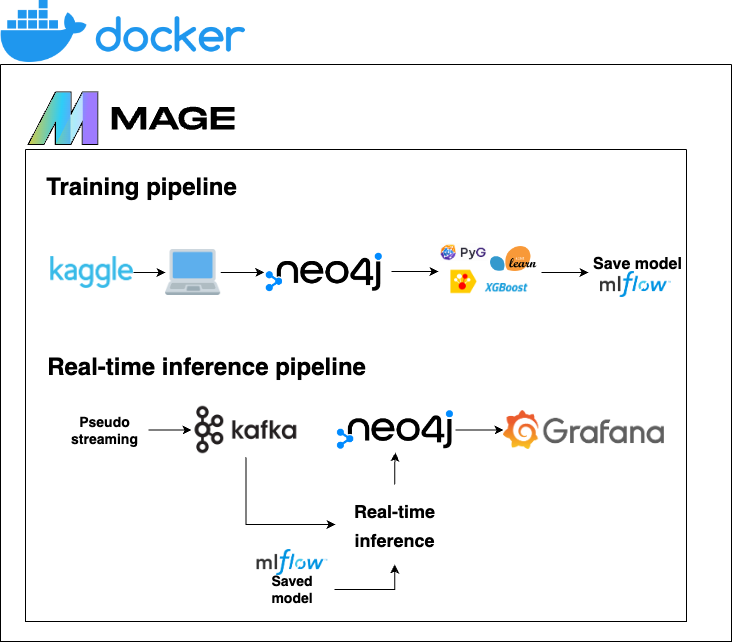
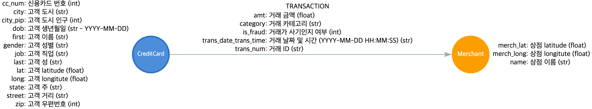

# 국민은행 AI 대회 프로젝트: 실시간 그래프 DB 분석을 통한 사기 탐지


참고: [ownml.co](https://www.ownml.co/) 

# 아키텍처 개요



참고: [draw.io](https://draw.io/)

* **Kaggle** - 트랜잭션 데이터는 [여기](https://www.kaggle.com/datasets/kartik2112/fraud-detection)
* **Docker** - 애플리케이션이 다양한 환경에서 일관되게 작동하도록 컨테이너화를 사용
* **Mlflow** - 개발 중 모델 비교를 용이하게 하기 위해 사용
* **모델 훈련** - sklearn, xgboost, catboost, PyG 등 다양한 라이브러리를 사용하여 모델 훈련
* **Mage** - 모델 훈련 및 실시간 추론 파이프라인의 파이프라인 오케스트레이션에 사용
* **Neo4j** - 트랜잭션 데이터를 노드와 엣지로 저장하기 위해 그래프 데이터베이스로 사용
* **Kafka** - 실시간 트랜잭션 처리를 보장하기 위해 사용
* **Grafana** - 실시간 대시보드 생성 및 모니터링에 사용
* **Streamlit** - 모델 사전(Model Dictionary)을 호스팅하여 모델, 평가 지표, 피처 중요도 그래프를 표시


# 데이터 설명



참고: [arrows.app](https://arrows.app/)

# 실시간 추론 파이프라인

실시간 정보를 시뮬레이션하기 위해 Kaggle의 `fraudTest.csv` 데이터셋을 사용하여 초당 5개의 트랜잭션을 Kafka를 통해 전송합니다. 트랜잭션은 수신되고 모델이 사기/비사기를 예측하는 새로운 열이 생성됩니다. 이 데이터는 neo4j로 전송되며, Grafana 대시보드에서 5초마다 최신 정보로 업데이트됩니다.


### 모델 지표:
- 그래프 합성 네트워크 (GCN) - 정확도: 0.8809, 정밀도: 0.8133, 재현율: 0.9883, F1: 0.8923
- XGBoost - 정확도: 0.9730, 정밀도: 0.9737, 재현율: 0.9717, F1: 0.9727
- CatBoost - 정확도: 0.9759, 정밀도: 0.9757, 재현율: 0.9757, F1: 0.9757

# 모니터링

Neo4j에서 정보를 추출하고 Grafana에서 실시간 대시보드를 통해 시각화합니다.


# 모델 의사결정

모델이 트랜잭션을 비사기 또는 사기로 분류하는 데 어떤 요소가 영향을 미치는지 더 잘 이해하기 위해, Streamlit에서 모델 사전(Model Dictionary)을 호스팅합니다. 확인할 수 있는 정보는 다음과 같습니다:
* 모델 위치/정보
* 피처 중요도
* 모델 메트릭
* 혼동 행렬
* SHAP 요약 그래프


# 재현성

**사전 요구 사항**
* Docker Desktop
* Python >=3.9
* Git/GitHub 

**설정 방법**
1. 저장소를 클론합니다: `https://github.com/divakaivan/kb_project.git`
2. `mage_orchestration` 디렉토리에 Kaggle API 자격 증명을 `kaggle.json` 파일로 저장합니다.
3. 터미널에서 `make`를 입력하면 다음과 같은 화면이 표시됩니다.
```
Usage: make [option]

Options:
  help                 Show this help message
  build                Build docker services
  start                Start docker services (detached mode)
  model-dict           Create model dictionary UI
  stop                 Stop docker services
```
4. `make build`로 `docker-compose.yaml`에서 모든 Docker 서비스를 빌드합니다.
5. 다음으로, `make start`를 실행하여 빌드된 모든 Docker 서비스를 시작합니다. (중지하려면 `make stop`을 실행합니다.)

**모델 훈련**
1. http://localhost:6789에서 실행 중인 Mage로 이동하여 사이드바에서 파이프라인 페이지로 이동합니다.
2. Kaggle에서 데이터를 다운로드하려면 `get_kaggle_data` 파이프라인을 실행합니다.
3. 그런 다음 `load_batch_into_neo4j`를 실행합니다.
4. `train_*` 파이프라인 중 하나(또는 여러 개)를 실행합니다.

**실시간 트랜잭션 분석**
1. `train_*` 파이프라인 중 하나를 실행한 적이 있어야 합니다.
2. `make start`를 실행할 때 kafka-producer 서비스가 트랜잭션 전송을 시작했으므로, 이제 `stream_predictions` 파이프라인을 실행하면 오른쪽 하단에서 트랜잭션이 처리되는 것을 볼 수 있습니다. 또한 neo4j에 새 트랜잭션이 로드되는 것을 확인할 수 있습니다 (TRANSACTION 번호가 증가함에 따라). kafka-producer 서비스에서 사용된 데이터셋에는 500,000개 이상의 행이 포함되어 있어 초당 5개의 트랜잭션이 전송되므로 30시간 이상 데이터를 전송할 수 있습니다.

**모니터링**
1. Mage에서 `stream_predictions` 파이프라인이 실행 중이면 http://localhost:3000에서 Grafana를 열 수 있습니다.
2. neo4j 및 대시보드와의 연결이 미리 로드되어 있어 대시보드 섹션으로 바로 이동할 수 있습니다.

**모델 사전**
- 저장소에 이미 일부 모델이 포함되어 있으므로, 터미널에서 `make model-dict`를 실행할 수 있습니다. 이 명령은 필요한 종속성을 설치하고 브라우저에서 Streamlit UI를 엽니다. (대안으로 http://localhost:8501로 이동합니다.)
- 여기에서 무언가를 보려면 Mage에서 `train_*` 파이프라인 중 하나가 실행되어 있어야 합니다.

**Docker 서비스 정보**
| 서비스   | 포트 |
|-----------|------|
| neo4j     | 7474/7687 |
| mage      | 6789 |
| kafka     | 9093 |
| zookeeper | 2181 |
| mlflow    | 5001 |
| grafana   | 3000 |

# 향후 개선 사항

* 다음 서비스를 위한 클라우드 제공 업체 사용 (Terraform을 사용하여 리소스를 제공):
    * MLflow 데이터베이스 및 아티팩트 저장소
    * Mage 
* 다음에 대한 공식 클라우드 옵션 사용:
    * Neo4j 데이터베이스
    * Grafana
* Streamlit 배포하여 접근성 향상
* 단위/통합 테스트 추가
* 모델 사전에 Mlflow에서 모델 로드
* 모니터링 개선
